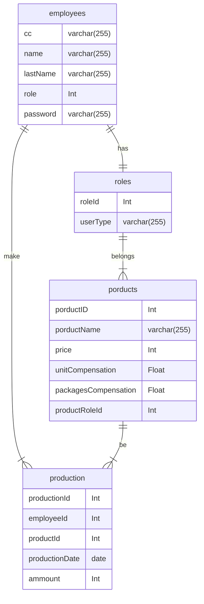

# Footwear API
## Description
API for footwear management
## Installation
1. Clone the repository
2. Create the virtual environment:
```bash
python3.10 -m venv env
```
3. Activate the virtual environment:
```bash
# Linux
source env/bin/activate
# Windows
env\Scripts\activate
```
4. Install the dependencies:
```bash
pip install -r requirements.txt
```
5. Create the .env file:
```bash
# Linux
touch .env
# Windows
type nul > .env
```
6. Add the environment variables:
```bash
API_VERSION = "1.0"
APP_NAME = "Calzado"
SQLALCHEMY_DATABASE_URI = database_uri
SQLALCHEMY_TRACK_MODIFICATIONS = False
DEBUG_MODE = True
```
7. Add the .flaskenv file:
```bash
# Linux
touch .flaskenv
# Windows
type nul > .flaskenv
```
8. Add the environment variables:
```bash
#.flaskenv
FLASK_APP=main
FLASK_ENV=development
FLASK_RUN_PORT=8080
FLASK_DEBUG=1
```
6. Run the project:
```bash
flask run
```

# Database [<a href="https://mermaid.js.org/syntax/entityRelationshipDiagram">mermaid</a>]

